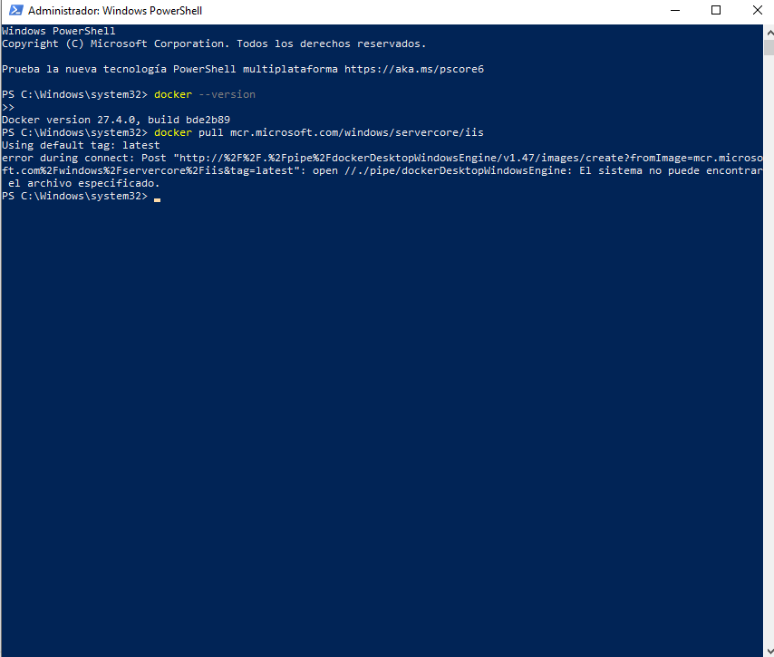
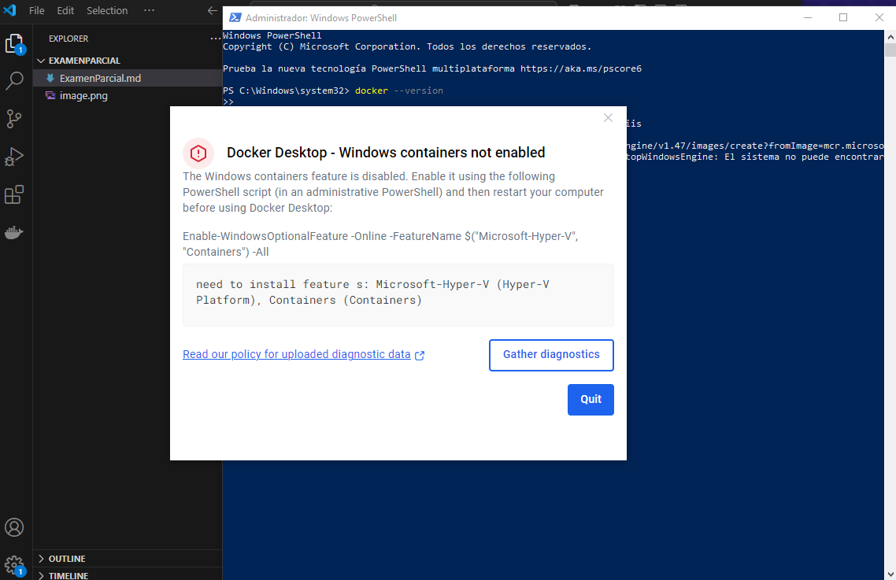

# Documentación de Errores en Docker y Configuración de Contenedores
Este documento describe los pasos para desplegar un servidor web utilizando **Internet Information Services (IIS)** en un contenedor Docker sobre un entorno Windows.

## Requisitos Previos

- **Docker Desktop** instalado y configurado en un entorno Windows.
- **PowerShell** o **Terminal** de Windows para ejecutar los comandos.
- Conexión a internet para descargar las imágenes de Docker necesarias.
## Concepto de IIS (Internet Information Services)
IIS (Internet Information Services) es un servidor web y de aplicaciones desarrollado por Microsoft para sistemas operativos Windows. Su función principal es alojar y administrar sitios web, servicios HTTP y aplicaciones basadas en tecnologías como ASP.NET. En el contexto de Docker, IIS puede ser utilizado en contenedores Windows para ejecutar aplicaciones web en un entorno aislado y escalable.


## Verificación de la Versión de Docker

Para comprobar la versión instalada de Docker, se ejecutó el siguiente comando en la terminal:

```sh
docker version
```


El resultado mostró que Docker está operando en modo Linux, lo que confirma la incompatibilidad con contenedores de Windows en la configuración actual.

## Problema Encontrado
Al intentar ejecutar Docker en un entorno con máquinas frizadas, se presentó el siguiente error:

- Docker no está habilitado para trabajar con contenedores de Windows, solo de Linux.
- Al iniciar Docker, aparece un mensaje solicitando reiniciar la PC.
- Debido a que las máquinas están frizadas, no es posible realizar cambios persistentes en la configuración del sistema.


## Posibles Soluciones

1. Configurar Docker para ejecutar contenedores de Windows en lugar de Linux.
2. Solicitar permisos administrativos para realizar cambios en la configuración del sistema y deshabilitar el frizado temporalmente.
3. Utilizar una máquina virtual con Windows y Docker configurado adecuadamente.

---

Esta documentación es parte del registro de errores encontrados y las verificaciones realizadas durante la configuración de Docker en el entorno de trabajo.
